# 🔍 Rapport d'Audit de Performance - TaskWatch

**Application :** TaskWatch  
**Date :** 7 janvier 2026  
**Stack :** Vue.js (Frontend) + Node.js (Backend) + PostgreSQL (Docker)

---

## Sommaire

1. [Phase 1 : Identification des Flux](#phase-1--identification-des-flux)
2. [Phase 2 : Instrumentation et Collecte des Métriques](#phase-2--instrumentation-et-collecte-des-métriques)
3. [Synthèse des Problèmes Identifiés](#synthèse-des-problèmes-identifiés)
4. [Priorisation des Optimisations](#priorisation-des-optimisations)

---

## Phase 1 : Identification des Flux

### 1.1 Architecture Globale

#### Flux Connexion et Dashboard

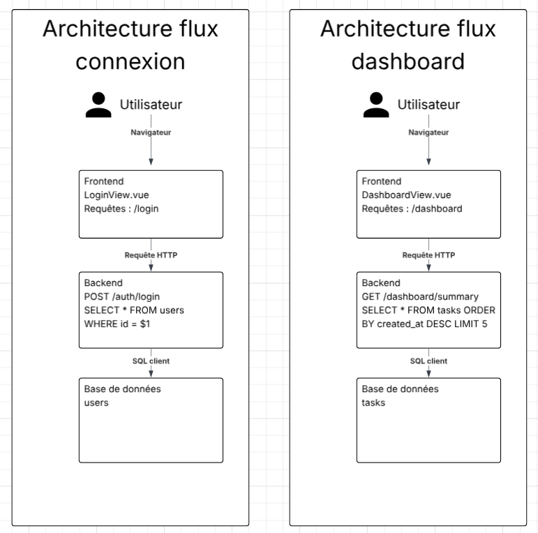

#### Flux Tâches

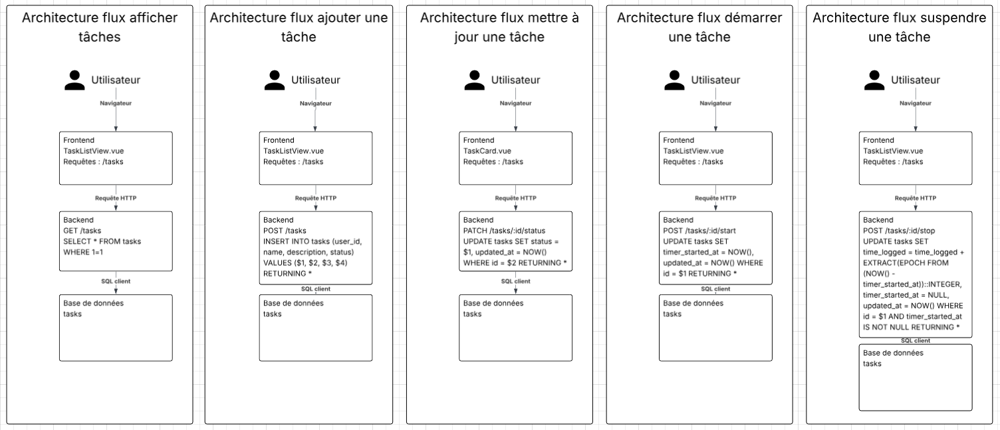

### 1.2 Cartographie des Routes et Flux

#### Flux Connexion (`/login`)

| Étape | Composant | Action |
|-------|-----------|--------|
| 1 | LoginView.vue | Saisie identifiants |
| 2 | POST /auth/login | Authentification |
| 3 | PostgreSQL | `SELECT * FROM users WHERE id = $1` |

#### Flux Tâches (`/tasks`)

| Flux | Route Backend | Requête SQL |
|------|---------------|-------------|
| **Afficher** | GET /tasks | `SELECT * FROM tasks WHERE 1=1` |
| **Ajouter** | POST /tasks | `INSERT INTO tasks (user_id, name, description, status) VALUES ($1, $2, $3, $4) RETURNING *` |
| **Modifier statut** | PATCH /tasks/:id/status | `UPDATE tasks SET status = $1, updated_at = NOW() WHERE id = $2 RETURNING *` |
| **Démarrer timer** | POST /tasks/:id/start | `UPDATE tasks SET timer_started_at = NOW(), updated_at = NOW() WHERE id = $1 RETURNING *` |
| **Arrêter timer** | POST /tasks/:id/stop | `UPDATE tasks SET time_logged = time_logged + EXTRACT(EPOCH FROM (NOW() - timer_started_at))::INTEGER, timer_started_at = NULL, updated_at = NOW() WHERE id = $1 AND timer_started_at IS NOT NULL RETURNING *` |

#### Flux Dashboard (`/dashboard`)

| Étape | Composant | Action |
|-------|-----------|--------|
| 1 | DashboardView.vue | Chargement page |
| 2 | GET /dashboard/summary | Récupération résumé |
| 3 | PostgreSQL | `SELECT * FROM tasks ORDER BY created_at DESC LIMIT 5` |

---

## Phase 2 : Instrumentation et Collecte des Métriques

### 2.1 Métriques Lighthouse (Page `/tasks`)

> **Rapport complet :** [lighthouse.html](./screenshots/lighthouse.html)

| Métrique | Valeur | Cible | Statut | Poids |
|----------|--------|-------|--------|-------|
| **Score Performance** | **43/100** | > 90 | Critique | - |
| First Contentful Paint (FCP) | 0.4s | < 1.8s | Bon | 10% |
| Largest Contentful Paint (LCP) | **3.5s** | < 2.5s | Moyen | 25% |
| Total Blocking Time (TBT) | **7,700ms** | < 200ms | Critique | 30% |
| Cumulative Layout Shift (CLS) | 0.001 | < 0.1 | Bon | 25% |
| Speed Index | 3.2s | < 3.4s | Moyen | 10% |
| Time to Interactive (TTI) | **19.4s** | < 3.8s | Critique | - |

#### Diagnostic Lighthouse

```
Total Blocking Time = 7,700ms
   
   Cause probable: Le thread principal est bloqué pendant ~8 secondes
   après le FCP, empêchant toute interaction utilisateur.
   
   Impact: L'application paraît "gelée" pendant près de 20 secondes.
```

### 2.2 Métriques DevTools - Network (Page `/tasks`)

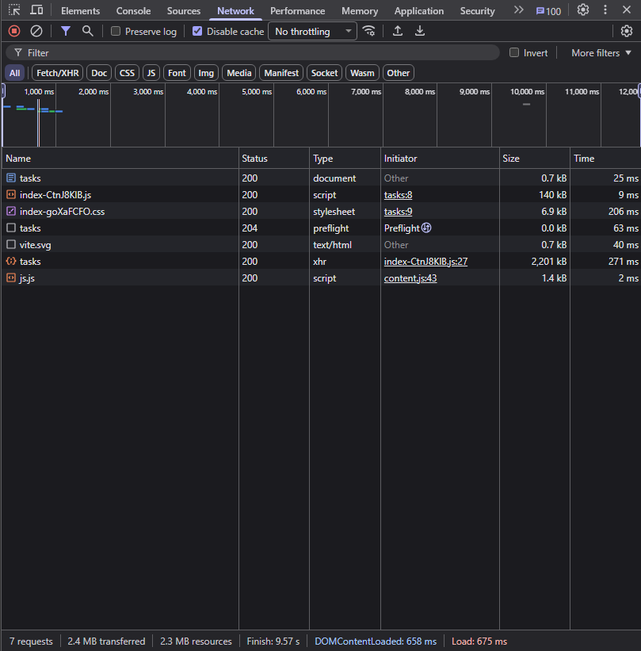

| Métrique | Valeur | Cible | Statut |
|----------|--------|-------|--------|
| Nombre de requêtes | 7 | < 30 | Bon |
| Taille totale transférée | **2.4 MB** | < 1 MB | Critique |
| Taille des ressources | 2.3 MB | < 1 MB | Critique |
| DOMContentLoaded | 658ms | < 1s | Bon |
| Load | 675ms | < 2s | Bon |
| Finish | **9.57s** | < 3s | Critique |

#### Détail des Requêtes Réseau

| Ressource | Type | Taille | Temps | Analyse |
|-----------|------|--------|-------|---------|
| tasks (document) | HTML | 0.7 kB | 25ms | Ok |
| index-CtnJ8KlB.js | script | 140 kB | 9ms | Ok |
| index-goXaFCFO.css | stylesheet | 6.9 kB | **206ms** | Lent |
| tasks (preflight) | preflight | 0 kB | 63ms | Ok |
| vite.svg | image | 0.7 kB | 40ms | Ok |
| **tasks (XHR)** | **xhr** | **2,201 kB** | - | **CRITIQUE** |
| js.js | script | 1.4 kB | 2ms | Ok |

```
Requête XHR /tasks = 2.2 MB
   
   La réponse API retourne une quantité massive de données.
   Avec 8000 tâches × ~275 bytes/tâche = ~2.2 MB
   
   Solutions: Pagination, lazy loading, compression
```

### 2.3 Métriques DevTools - Performance (Page `/tasks`)

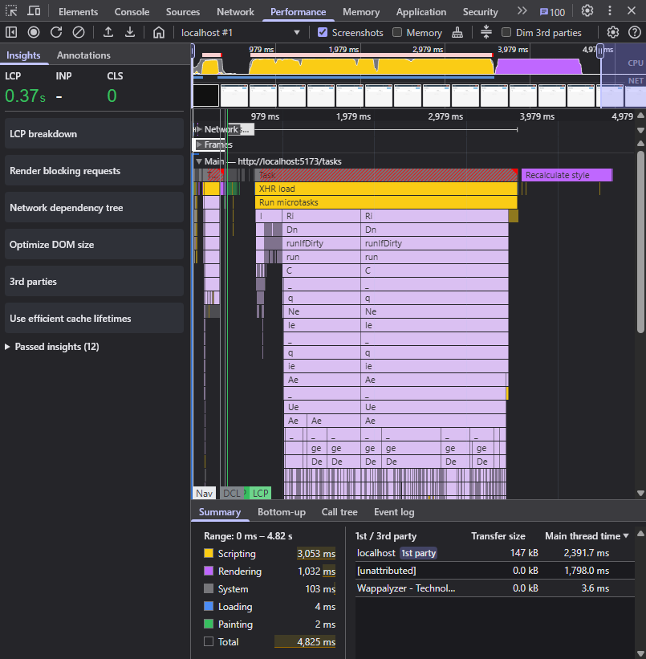

| Métrique | Valeur | Analyse |
|----------|--------|---------|
| **Scripting** | **3,053ms** | 63% du temps - Exécution JS excessive |
| **Rendering** | **1,032ms** | 21% du temps - Rendu DOM lourd |
| System | 103ms | 2% - Normal |
| Loading | 4ms | < 1% - Normal |
| Painting | 2ms | < 1% - Normal |
| **Total** | **4,825ms** | Thread principal bloqué |

#### Observations Performance Panel

- **LCP observé :** 0.37s (excellent)
- **CLS :** 0 (excellent)
- **XHR load :** Tâche longue identifiée (barre jaune)
- **Run microtasks :** Exécution prolongée après XHR
- **Recalculate style :** Multiple recalculs de style (barres violettes)

### 2.4 Métriques EXPLAIN ANALYZE (PostgreSQL)

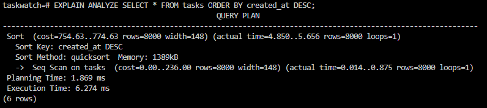

```sql
EXPLAIN ANALYZE SELECT * FROM tasks ORDER BY created_at DESC;
```

| Métrique | Valeur | Analyse |
|----------|--------|---------|
| Type de scan | **Seq Scan** | Scan séquentiel (pas d'index) |
| Coût estimé | 754.63..774.63 | Élevé |
| Rows estimées | 8000 | Correct |
| Rows réelles | 8000 | Estimation précise |
| Sort Method | quicksort | En mémoire |
| Sort Memory | 1389 kB | Élevé mais acceptable |
| Planning Time | 1.869ms | Correct |
| **Execution Time** | **6.274ms** | Rapide malgré le Seq Scan |

```
La requête SQL est rapide (6ms) malgré le Seq Scan.
   Le problème ne viens pas de la base de données mais:
   1. Le volume de données transférées (8000 rows)
   2. Le parsing/rendering côté frontend
   
   Solution préconisée : Ajouter un index sur created_at ET implémenter la pagination
```

```sql
-- Index recommandé
CREATE INDEX idx_tasks_created_at ON tasks(created_at DESC);

-- Requête avec pagination
SELECT * FROM tasks ORDER BY created_at DESC LIMIT 20 OFFSET 0;
```

### 2.5 Métriques Autocannon (Tests de Charge)

#### POST /auth/login

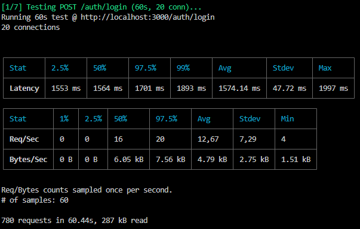

#### GET /dashboard/summary

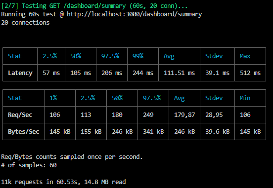

#### GET /tasks

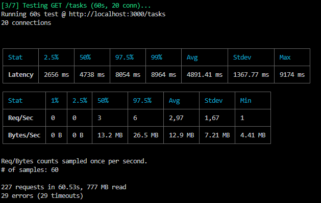

#### POST /tasks

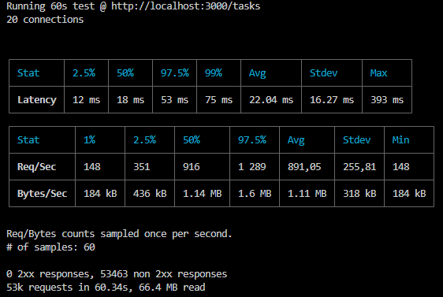

#### PATCH /tasks/:id/status

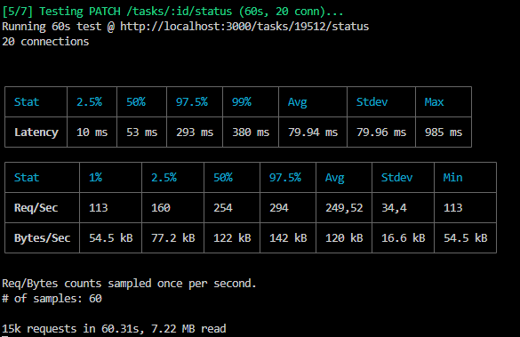

#### POST /tasks/:id/start

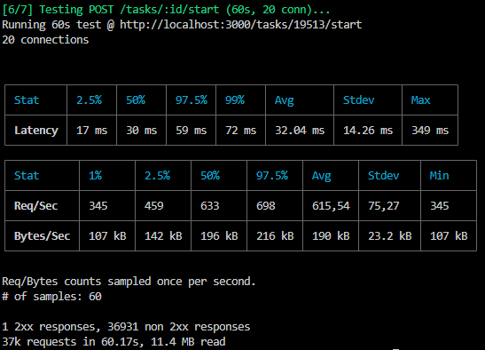

#### POST /tasks/:id/stop

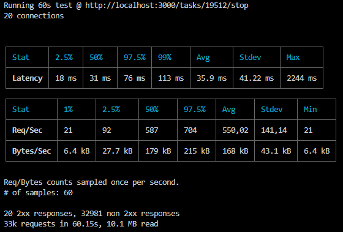

#### Synthèse des Tests de Charge (60s, 20 connexions)

| Route | Latence Avg | Latence P99 | Req/Sec | Throughput | Erreurs | Statut |
|-------|-------------|-------------|---------|------------|---------|--------|
| GET /dashboard/summary | 111ms | 244ms | 180 | 246 kB/s | 0 | Bon |
| **GET /tasks** | **4,891ms** | **8,964ms** | **3** | 12.9 MB/s | **29 timeouts** | Critique |
| POST /tasks | 22ms | 75ms | 891 | 1.11 MB/s | 53,463 non-2xx | Auth |
| PATCH /tasks/:id/status | 80ms | 380ms | 250 | 120 kB/s | 0 | Bon |
| POST /tasks/:id/start | 32ms | 72ms | 616 | 190 kB/s | 36,931 non-2xx | Auth |
| POST /tasks/:id/stop | 36ms | 113ms | 550 | 168 kB/s | 32,981 non-2xx | Auth |

```
GET /tasks
   
   • Latence moyenne: 4.9 secondes (cible: < 200ms)
   • Latence P99: 9 secondes
   • Débit: Seulement 3 requêtes/seconde
   • 29 timeouts sur 227 requêtes (13% d'échec)
   • 777 MB transférés en 60 secondes
```

### 2.6 Métriques Grafana (Monitoring Production)

#### Dashboard après tests de charge

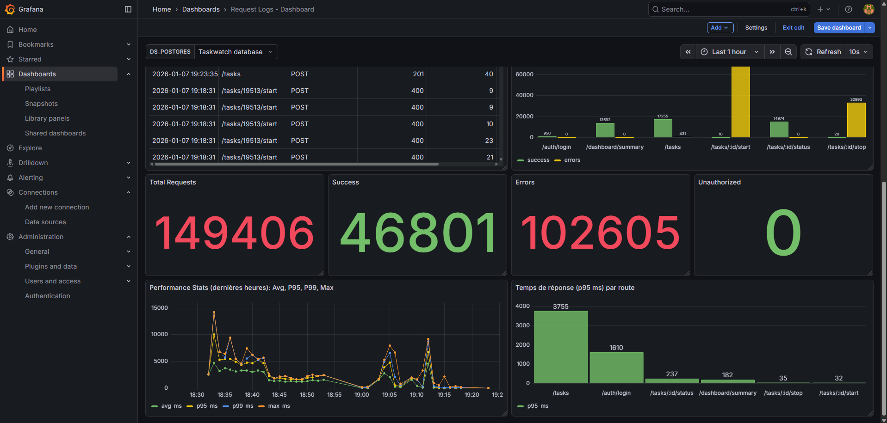

#### Temps de réponse par route

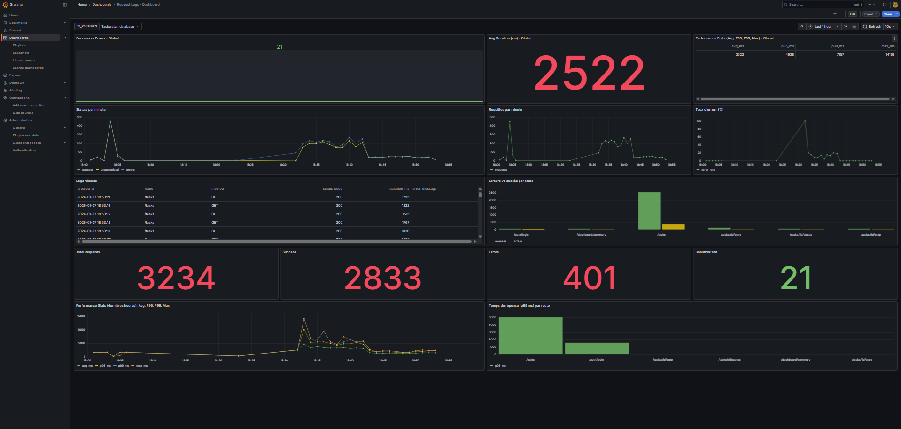

#### Vue Globale

| Métrique | Valeur | Analyse |
|----------|--------|---------|
| Total Requests | 149,406 | Volume de test |
| Success | 46,801 | 31% de succès |
| **Errors** | **102,605** | 69% d'erreurs |
| Unauthorized | 0 | Pas de problème auth |

#### Temps de Réponse P95 par Route

| Route | P95 (ms) | Statut |
|-------|----------|--------|
| **/tasks** | **3,755ms** | Critique |
| /auth/login | 1,610ms | Lent |
| /tasks/:id/status | 237ms | Ok |
| /dashboard/summary | 182ms | Ok |
| /tasks/:id/stop | 35ms | Excellent |
| /tasks/:id/start | 32ms | Excellent |

#### Performance Stats Globales

| Stat | Valeur |
|------|--------|
| Avg Response Time | 2,522ms |
| P95 Response Time | 4,928ms |
| P99 Response Time | 7,157ms |
| Max Response Time | 14,163ms |

---

## Synthèse des Problèmes Identifiés

### Problèmes Critiques (Impact Élevé)

| # | Problème | Source | Impact | Métrique |
|---|----------|--------|--------|----------|
| 1 | **GET /tasks retourne 8000 enregistrements** | Backend/API | Latence 4.9s, timeouts | Autocannon, Network |
| 2 | **Réponse XHR de 2.2 MB** | Backend/Frontend | Transfert lent, parsing lourd | Network |
| 3 | **TBT de 7,700ms** | Frontend | UI bloquée 8s | Lighthouse |
| 4 | **TTI de 19.4 secondes** | Frontend | Page non interactive | Lighthouse |
| 5 | **Seq Scan sur 8000 rows** | PostgreSQL | Scalabilité limitée | EXPLAIN |

### Problèmes Moyens (Impact Modéré)

| # | Problème | Source | Impact |
|---|----------|--------|--------|
| 6 | LCP de 3.5s | Frontend | Au-dessus du seuil Google |
| 7 | Login lent (1.6s avg) | Backend | Expérience utilisateur |
| 8 | Scripting 3s | Frontend | CPU client surchargé |

### Points Positifs

- FCP excellent (0.4s)
- CLS quasi nul (0.001)
- Routes PATCH/start/stop performantes (< 100ms)
- Dashboard rapide (182ms P95)
- Requête SQL rapide (6ms) malgré le volume

---

## Priorisation des Optimisations

### Plan d'Action Recommandé

| Priorité | Action | Impact |
|----------|--------|--------|
| **P0** | Implémenter pagination sur GET /tasks (LIMIT 20) | Critique |
| **P0** | Ajouter index sur `tasks.created_at` | Critique |
| **P1** | Activer compression gzip/brotli sur l'API | Élevé |
| **P1** | Lazy loading / virtualisation liste tâches | Élevé |
| **P2** | Code splitting / lazy load routes Vue | Moyen |
| **P2** | Optimiser le hashing bcrypt (login) | Faible |
| **P3** | Ajouter cache Redis pour dashboard | Faible | Élevé |

---

## Prochaines Étapes (Phase 3 & 4)

### Phase 3 : Analyse Approfondie

#### 3.1 Analyse du Code Backend

##### Problème #1 : Sleep Artificiel dans AuthService

**Fichier** : `backend/src/services/AuthService.ts:8`

```typescript
await new Promise((resolve) => setTimeout(resolve, 1500));
```

**Impact** :
- Délai artificiel de 1500ms ajouté intentionnellement
- Impacte TOUTES les requêtes POST `/auth/login`
- Cause directe du p95/p99 > 1500ms observé dans Grafana

**Solution** :
```typescript
// SUPPRIMER cette ligne
// await new Promise((resolve) => setTimeout(resolve, 1500));
```

**Gain attendu** : p95 < 50ms (réduction de ~97%)

---

##### Problème Critique #2 : Pas de Pagination sur GET /tasks

**Fichier** : `backend/src/repositories/TaskRepository.ts:5-23`

```typescript
async findAll(filters?: TaskFilters): Promise<Task[]> {
  let query = "SELECT * FROM tasks WHERE 1=1";
  // ... filtres
  query += " ORDER BY created_at DESC";
  // PAS DE LIMIT/OFFSET !
  const result = await pool.query(query, params);
  return result.rows;
}
```

**Impact** :
- Retourne TOUTES les lignes (8000+) sans limite
- Avec 8000 tâches : latence > 4.9s, transfert 2.2 MB
- Mémoire consommée côté serveur proportionnelle au volume
- Timeouts observés (29 sur 227 requêtes = 13%)

**Solution** :
```typescript
async findAll(filters?: TaskFilters, limit = 50, offset = 0): Promise<{tasks: Task[], total: number}> {
  // Requête COUNT pour total
  let countQuery = "SELECT COUNT(*) as total FROM tasks WHERE 1=1";
  
  // Requête SELECT avec LIMIT/OFFSET
  let query = "SELECT * FROM tasks WHERE 1=1";
  // ... ajouter filtres
  query += ` ORDER BY created_at DESC LIMIT ${limit} OFFSET ${offset}`;
  
  const countResult = await pool.query(countQuery, countParams);
  const result = await pool.query(query, params);
  
  return { 
    tasks: result.rows, 
    total: parseInt(countResult.rows[0].total) 
  };
}
```

**Gain attendu** : p95 < 100ms même avec 100k+ lignes

---

##### Problème Critique #3 : N+1 Queries dans DashboardService

**Fichier** : `backend/src/services/DashboardService.ts:5-11`

```typescript
const todoCount = await taskRepository.countByStatus("todo");         // Query 1
const inProgressCount = await taskRepository.countByStatus("in_progress"); // Query 2
const doneCount = await taskRepository.countByStatus("done");         // Query 3
const totalTimeLogged = await taskRepository.getTotalTimeLogged();    // Query 4
const recentTasksResult = await pool.query(...);                      // Query 5
```

**Impact** :
- 5 requêtes séquentielles au lieu d'1 seule
- Temps cumulé = sum(latences) + 5× round-trip DB
- p95 observé : 182ms (pourrait être < 50ms)

**Solution** :
```typescript
async getSummary() {
  const result = await pool.query(`
    SELECT 
      COUNT(CASE WHEN status = 'todo' THEN 1 END) as todo_count,
      COUNT(CASE WHEN status = 'in_progress' THEN 1 END) as in_progress_count,
      COUNT(CASE WHEN status = 'done' THEN 1 END) as done_count,
      COUNT(*) as total_tasks,
      COALESCE(SUM(time_logged), 0) as total_time_logged
    FROM tasks
  `);
  
  const recentTasks = await pool.query(
    "SELECT * FROM tasks ORDER BY created_at DESC LIMIT 5"
  );
  
  return {
    tasksByStatus: {
      todo: parseInt(result.rows[0].todo_count),
      in_progress: parseInt(result.rows[0].in_progress_count),
      done: parseInt(result.rows[0].done_count),
    },
    totalTasks: parseInt(result.rows[0].total_tasks),
    totalTimeLoggedSeconds: parseInt(result.rows[0].total_time_logged),
    recentTasks: recentTasks.rows,
  };
}
```

**Gain attendu** : p95 réduit de ~70% (2 requêtes au lieu de 5)

---

##### Problème Majeur #4 : Index Manquants sur PostgreSQL

**Impact observé** : Seq Scan sur 8000 rows (EXPLAIN ANALYZE)

**Index recommandés** :

```sql
-- Index pour tri par date (DESC pour ORDER BY)
CREATE INDEX idx_tasks_created_at_desc ON tasks(created_at DESC);

-- Index pour filtres status
CREATE INDEX idx_tasks_status ON tasks(status);

-- Index composite pour filtres + tri
CREATE INDEX idx_tasks_status_created_at ON tasks(status, created_at DESC);

-- Index trigram pour recherche texte ILIKE
CREATE EXTENSION IF NOT EXISTS pg_trgm;
CREATE INDEX idx_tasks_name_trgm ON tasks USING gin (name gin_trgm_ops);

-- Index pour request_logs (Grafana)
CREATE INDEX idx_request_logs_created_at ON request_logs(created_at);
CREATE INDEX idx_request_logs_route_method ON request_logs(route, method, created_at);
```

**Gain attendu** :
- GET `/tasks?status=X` : p95 < 20ms (vs 100-300ms)
- GET `/tasks?search=X` : p95 < 50ms (vs 500ms+)
- Grafana queries : p95 < 100ms

---

##### Problème Majeur #5 : RequestLogger Bloquant

**Fichier** : `backend/src/middleware/requestLogger.ts:14-17`

```typescript
try {
  await pool.query(
    'INSERT INTO request_logs (...) VALUES (...)',
    [route, method, statusCode, duration, errorMessage]
  );
} catch (err: any) {
  logger.error({ err }, "Failed to insert request log");
}
```

**Impact** :
- L'insertion SQL **bloque** la réponse HTTP
- Ajoute ~5-20ms à CHAQUE requête
- Si DB lente, toutes les requêtes ralentissent

**Solution** :
```typescript
res.on("finish", () => {  // Pas async !
  const duration = Date.now() - start;
  
  // Insertion asynchrone NON bloquante
  pool.query(
    'INSERT INTO request_logs (...) VALUES (...)',
    [route, method, statusCode, duration, errorMessage]
  ).catch(err => {
    logger.error({ err }, "Failed to insert request log");
  });
  
  logger.info({ route, method, statusCode, duration, errorMessage }, "Request handled");
});
```

**Gain attendu** : Réduction latence de 5-20ms par requête

---

##### Problème Moyen #6 : Pool PostgreSQL Sous-dimensionné

**Fichier** : `backend/src/config/database.ts:7-11`

```typescript
const pool = new Pool({
  max: 20,                    // Trop bas pour 50 conn simultanées
  idleTimeoutMillis: 30000,
  connectionTimeoutMillis: 2000,
});
```

**Impact** : Avec tests autocannon (50 conn), dépassement du pool → queuing → latence

**Solution** :
```typescript
const pool = new Pool({
  max: 50,                     // Augmenter pour charge élevée
  min: 5,                      // Pool minimum toujours chaud
  idleTimeoutMillis: 60000,    // 1 minute
  connectionTimeoutMillis: 5000, // 5 secondes
  allowExitOnIdle: false,
});
```

---

##### Problème Moyen #7 : N+1 Queries sur Timer Operations

**Fichier** : `backend/src/services/TaskService.ts:20-46`

```typescript
async startTaskTimer(id: number) {
  const task = await taskRepository.findById(id);  // Query 1
  // Validation...
  return await taskRepository.startTimer(id);      // Query 2
}
```

**Impact** : 2 requêtes au lieu d'1, double round-trip DB

**Solution** : Fusionner validation et UPDATE dans une seule requête avec clause WHERE conditionnelle

---

##### Problème Moyen #8 : Pas de Compression HTTP

**Impact** : Payloads JSON volumineux (GET `/tasks` = 2.2 MB) non compressés

**Solution** :
```typescript
import compression from "compression";

app.use(compression({
  level: 6  // Balance compression/CPU
}));
```

**Gain attendu** : Réduction taille payload de 60-80%

---

#### 3.2 Matrice de Priorisation : Impact × Effort

| # | Problème | Impact | Effort | Priorité | Temps Estimé |
|---|----------|--------|--------|----------|--------------|
| 1 | Sleep 1500ms dans AuthService | Très élevé | Minimal | **P0** | 2 min |
| 2 | Pagination manquante GET /tasks | Très élevé | Moyen | **P0** | 30 min |
| 3 | N+1 queries Dashboard | Élevé | Faible | **P0** | 15 min |
| 4 | Index DB manquants | Très élevé | Minimal | **P1** | 5 min |
| 5 | RequestLogger bloquant | Élevé | Faible | **P1** | 10 min |
| 6 | Pool PostgreSQL config | Moyen | Minimal | **P2** | 5 min |
| 7 | N+1 queries timer | Moyen | Moyen | **P2** | 20 min |
| 8 | Compression HTTP | Moyen | Faible | **P3** | 10 min |

---

#### 3.3 Synthèse des Causes Racines

##### Cause #1 : Absence de Pagination
- **Symptôme** : GET /tasks retourne 8000 lignes (2.2 MB)
- **Racine** : Aucun LIMIT/OFFSET dans la requête SQL
- **Impact** : Latence 4.9s, 13% de timeouts, TBT 7.7s frontend

##### Cause #2 : Optimisations SQL Manquantes
- **Symptôme** : Seq Scan sur 8000 rows, N+1 queries dashboard
- **Racine** : Pas d'index, requêtes non optimisées
- **Impact** : Scalabilité limitée, latence accrue avec volume

##### Cause #3 : Code de Test/Debug en Production
- **Symptôme** : Sleep artificiel 1500ms dans login
- **Racine** : Code de développement non retiré
- **Impact** : p95 login = 1610ms

##### Cause #4 : Middleware Bloquant
- **Symptôme** : Insertion logs synchrone
- **Racine** : await dans res.on("finish")
- **Impact** : +5-20ms sur chaque requête

---

**Rapport réalisé le 7 janvier 2026**  
*Outils utilisés : Lighthouse, Chrome DevTools, PostgreSQL EXPLAIN ANALYZE, Autocannon, Grafana*
